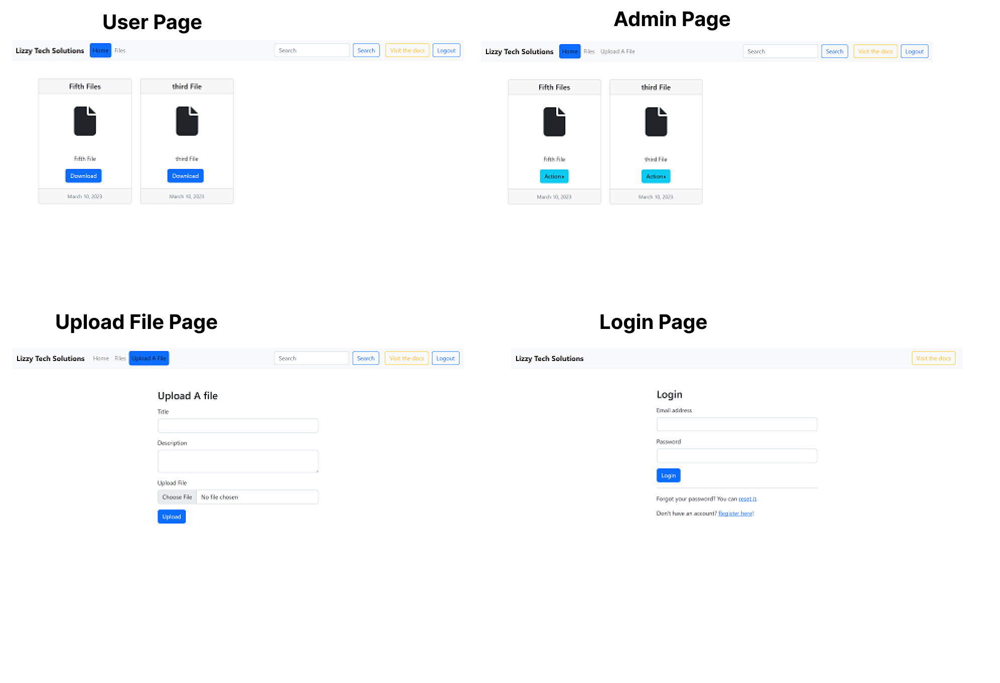
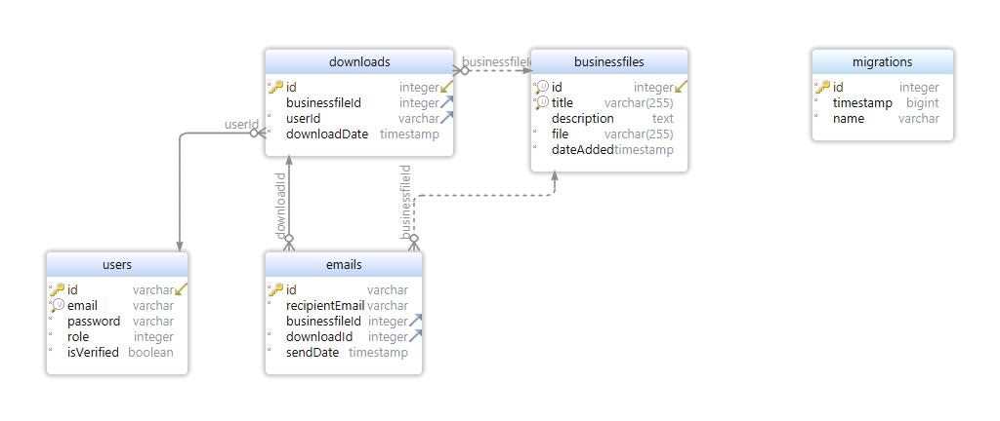

# File Server Project

## Description

This is a solution to AmaliTech's Training Phase 3 challenge.

## Getting Started

- [Overview](#overview)
  - [Requirements](#requirements)
  - [Screenshots](#screenshots)
  - [ER Diagram](#erdiagram)
  - [Link](#link)
- [Design Process](#design-process)
  - [Built with](#built-with)
- [Local Setup](#local-setup)
  - [Server](#server)
  - [Client](#client)
- [Author](#author)

## Overview

### Requirements

Users should be able to:

1. Signup & log in with an email and password with account verification. There should be a reset password feature to recover lost passwords password.
2. See a feed page that contains a list of files that can be downloaded.
3. Search the file server
4. Send a file to an email through the platform

Admin should be able to:
1. Should be able to upload files with a title and description
2. Should be able to see the number of downloads and number of emails sent for each file 

### Screenshots



### ER Diagram


### Link

- Web url: [divine-file-server.vercel.app](https://divine-file-server.vercel.app/)

## Design Process

### Built with

- Server: Node, Typescript, Express, Typeorm
- Client: React (Using Typescript)
- Database: Postgres

## Local Setup
>You will need postgres running on your machine 

Clone the project
```bash
git clone https://github.com/Santadd/divine-file-server.git
cd divine-file-server
```
### Server

>Running the backend application

Start the backend service by following these steps:
```bash
cd server
```
Create a  `.env` file in the server folder. This file should have the following variables with your own values

```bash
# Port number to be used by the application. Make sure to make it different from the client port
APP_PORT = 3001

#Database Configuration (Uses Postgres)
DB_HOST = "<Database host address>"
DB_PORT = "<Database port number>"
DB_USERNAME = "<Database username>"
DB_PASSWORD = "<Database password>"
DB_DATABASE = "<Database name>" 

# EMAIL Config

#An email server to use when sending emails. For SendGrid, use "smtp.sendgrid.net". For Gmail use "smtp.gmail.com".
EMAIL_HOST = "<your-own-value>" 

#mail port used to send mail
EMAIL_PORT = 587 

# The username for the email sender's account, if required by the server.
# For SendGrid, use "apikey". For Gmail, use your Google username.
EMAIL_USERNAME = "<your-own-value>" 

# The password for the email sender's account, if required by the server.
# For SendGrid, use your API Key. For Gmail, use your Google password (you will need to allow less secure apps in your Google account settings).
EMAIL_PASSWORD = "<your-own-value>" 

# Set to any non-empty string to send emails via TLS.
EMAIL_USE_TLS = "no" 

# The sender that appears in all emails sent by the application.
EMAIL_SENDER = "<your-own-value>" 


# JWT Config

#A value to be used as seed by the JWT jsonwebtoken library in order to sign the payload
SECRET_ACCESS_KEY = "<your own value here>"


#JWT token expiration time, expressed in seconds or a string describing a time span zeit/ms
JWT_EXPIRATION_IN_SECS = "1h"


#Set url to match the client address. If you want to test the backend service only change it to match the backend address
PASSWORD_RESET_URL = "http://localhost:3000"
ACCOUNT_CONFIRMATION_URL = "http://localhost:3000"
```
Install the dependencies by running

```bash
yarn install
```
Make sure you have your database setup correctly. <br />
Run the database migrations using the following command
```bash
yarn migration:run
```
This will create all the tables and their relations.
You can use the revert and show migration commands to revert a migration or list all the migrations run.
```bash
yarn migration:revert #to revert migration

or

yarn migration:show #list migrations 
```
Finally start the server with:
```bash
yarn dev
```
With your backend service running you can start the client application

### Client
To run the client application
<br />
Move into the client folder 
```bash
cd client
```
Create a  `.env` file in the client folder. This file should have the following variables with your own values
```bash
#The backend service address
REACT_APP_BASE_API_URL=http://localhost:3001
```

install the dependencies
```bash
yarn install
```
start the client app
```bash
yarn start
```
You can now test your application
<br />
The API documentation can be accessed at `http://localhost:3001/api/docs` 
<br />
where the the port is your backend service port.
<br />

## Author

- Divine Duah
- Email:
  - duahdivine1@gmail.com
  - divine.duah@amalitech.org
